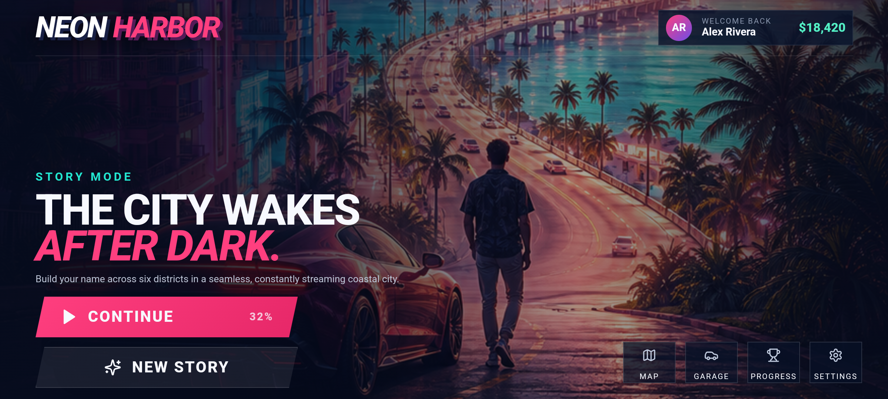
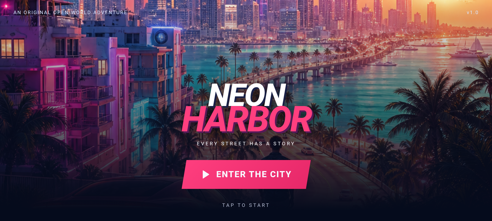

# Neon Harbor

Neon Harbor is an original, offline-first Android open-world action-driving prototype set in a fictional South Florida-inspired coastal city. It takes the procedural streaming approach from the supplied HTML project and builds a separate game, identity, UI system, world, controls, tests, and Android package.

This is not affiliated with, endorsed by, or derived from Grand Theft Auto, Rockstar Games, or Take-Two Interactive. It does not contain their branding, characters, story, assets, or protected Vice City map.





## Included

- Complete splash, main menu, character selection, loading, game HUD, pause, city map, garage, progress, and settings screens.
- Deterministic six-district coastal world generated in 96-metre chunks around the player.
- Instanced pools for buildings, palms, streetlights, roads, ground, parked cars, and moving traffic.
- Bounded 81-chunk cache so a long drive does not grow world memory indefinitely.
- Camera-relative keyboard and touch controls, analogue walk, outer-ring sprint, jump, acceleration/damping, collision sliding, drive/exit mode, follow camera, and speedometer.
- Two CC0 Kenney character models plus project-owned procedural city geometry and generated menu key art.
- Detailed deterministic unit/integration tests and a manual Android acceptance/performance plan.

## Run

```powershell
npm install
npm run dev
```

Open the Vite URL. Use WASD/arrow keys, Shift to sprint, Space to jump, or the touch controls. The Drive button toggles vehicle mode.

## Test and build

```powershell
npm test
npm run typecheck
npm run build
npx cap sync android
$env:JAVA_HOME = "C:\Program Files\Android\Android Studio\jbr"
$env:Path = "$env:JAVA_HOME\bin;$env:Path"
npm run android:debug
```

Debug APK: `android/app/build/outputs/apk/debug/app-debug.apk`.

Packaged prototype APK: `release/Neon-Harbor-v1.0.0-debug.apk` (generated locally and attached to the GitHub release rather than committed). SHA-256 checksums are in `release/SHA256SUMS.txt`. This APK is Android debug-signed for direct prototype installation; production store distribution requires a private upload key and an Android App Bundle.

## World and performance design

The fictional coastline is computed from deterministic low-frequency waves. Districts select building mixes and colors, while every chunk maintains two continuous road corridors. Rendering groups every repeated asset type into a Three.js `InstancedMesh`; increasing the streamed radius increases instance count rather than draw calls. Traffic is a fixed fleet with deterministic lane wrapping and no spawn/despawn allocation in the render loop.

See [TEST_PLAN.md](./TEST_PLAN.md) for automated coverage, device checks, and performance gates.

## Asset licenses

Runtime third-party assets are recorded in [ASSETS.md](./ASSETS.md). Kenney's Blocky Characters are CC0. The menu/splash key art is original, project-generated artwork. All environment geometry, traffic, vehicles, roads, UI, and map artwork are generated by project code.

## Production scope

This repository is a polished vertical slice, not a claimed equivalent to a multi-year AAA game. It does not include online multiplayer, a full campaign, voice acting, production vehicle physics, crowd AI, weapons, interiors, licensed music, store publishing credentials, or Rockstar content. A production Play Store release should replace the local release key, add store listing/privacy material, and run the device acceptance matrix.

## License

Project source code is MIT licensed. Third-party assets retain their respective licenses.
